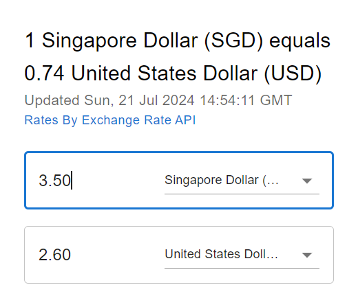

# Currency Converter Chrome Extension

    
    <h4 align="center">A Google Chrome extension for quick currency conversions.</h4>

## Installation

1. Clone this repository or download the ZIP file and extract it.
2. Open Google Chrome and navigate to `chrome://extensions/`.
3. Enable "Developer mode" by toggling the switch in the top right corner.
4. Click on "Load unpacked" and select the folder containing the extension files.

## Usage

1. Click on the Currency Converter icon in the Chrome toolbar.
2. Enter the amount you want to convert.
3. Select the source and target currencies from the dropdown menus.
4. View the converted amount instantly.